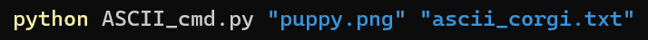

# NEW FEATURE
### Run on Command Line

## Why?
Changing which file to change has been a real pain!  
Calling the function through the terminal and declaring files from there makes this a lot easier.

## Demonstration



```                                     ...           -::          
                            ,---::::::::--,,    ,::;;+@@        
                         ,,--:;;;;;-,,,.:::-,,,,-:;++@@@+       
         :---,,,        .,--:.,           .-:--:;, +&:@@+:      
       -::;::::--,.     .,-. .:::;+;@&&H@;   ..   @##@-@+:      
       -:;;-,,,-:-,,....,,  ;HH####HH&&&&H&:     +####; +:.     
      ,-:-.+:,   .,--,,-   @&&&&H##&@@@@&&&H&:  ;#####; ::.     
      ,--.&&&H&;,   ...  .+@@@@+&HH@@@@@&&&HHH&@######& ,-.     
      ,- :&@&HH&&@.      @@@@@@@@@H@++@@&&HHH&&HH#####H  -.     
      ,. @@@@&HH&&&+. .;@@@&&&&@@@@&@+@@&&HHH&&HHH####H  -      
      .  @@@@&HHH&@&&&&&@@@&HH&&&@@&@+@&@&&H&&&&&H###H&  -      
      .  @+@@@&HH&&@@@@@@&@@&&&&@@@&@+@@@@@@@@&&&&###H: .,      
      .  ++++@@HHH&@;+++@@@++@@@@@@@@+@@@@@+;;@&&&H##H, .,      
      .  :+++@@@&H&@;++@&@;;:+@@@@&@@@@@@@@+;;@&H&H##H  ,.      
         ,++@@++;+@@;+@H&@;::+@+@&@@&@@@++@+--, ,@H##;  -.      
       .  ;++@@+++@@++&&;,,:-;@++&@&H@@&@++;.,   ,&##-  -       
       .   ++@@@@@@@++&-   ..-++@&@&#&@@@++:.,,-.-&##- .-       
        .  ,@+@&&&@++@+  ,- .,++@@&&#H&@@@++-.  ,+&H#. .-       
        .   :&@&&&@++++,.   .:+@@&&&HH&&@@@+;.  --&HH; .-.      
         .   ;&&&&+++++,:   .;+@@&HH##H@@@@@+;. .-HH&& ,-.      
          .   &H&&+++@;-.   :+@@&&H####&&&&&@@:,.;##HH  -.      
              .&H&@@@@@+,,.-+@@&H###$####HH&&@@;-@H#HH  -.      
               ,&&@+@&&&- ,+@@&###$$$$$$####H&@@@@H#HH .-.      
            .   &&&@&HH&+;+@@&H#$$$$$$$$$$###HH&&&H##; .,       
                :&&@&HH&@@@@&##$$$$$$$$$$$$####HH&H##. ,,       
                 &H@&#H&@&@&##$$$$###$$$$$$$$$###HH#&  -.       
              .   @&&#H&&&&H#$$$$##########$$$$##H##, .-.       
              .    @&#H&&&&#$$$$############$$$$####  .,        
             ..    +HHHH&&H#$$################$$$##H  :,        
           ....   +&HHH#H&#$$########HHH&&H###$$$$#+  :.        
          .,,,  -&&&&HH#HH#$#####H@@+;;;+++@H###$$#;  :.        
          ,--  ;&@+@@@H#H#$$####&+;::-------:@###$#@  :.        
         ,--  +&@+@@++&###$####&;-,,,,,. ..,-:&##$##. :,        
         ,-  +H@+;++;;@#######H;-,.....    ..-:##$##. :,        
        .,, ;H&@+;;+;+@H#####H@:,...        .,:@####  ;,        
        .-  &&&@;::++@&&#####H:-,.           .-@####, ;,        
        ,, -&&@@+;;;;+@&#####H:-.             ,+####, :,        
        ,. @&@@@@;-;+;@&######:,            ..,@####  :.        
        ,  @@@@@++:-;+;@######;.              -H####  -.        
        , .@@@@++;:::-:&H#####&-          .   .####; .,.        
        , .@@@+@+;+-,-@;&#####H;         ..   :###H  :,         
        , .@@+++;++-.;;;&######@    .    .,. ,H###,  :,         
        ,  @++;;+@+;-;-@+H######:     . ..,..+###@  ,:.         
        .  ++;;;+@+++-;:@&H#####H:  ..,.-,,,+####-  :-.         
        .  ,@+;;+;+@@;:-;@#######H+:--:-:;@H###$$#- ;-          
         .  ;+;;+;+@@&---+H#######HH&@@@&&H###$##$#,:,          
         .   +;;;;+@@&;,,;HH#######HH@+:+@&##$####H--,          
          .  ,+;::+@@&;,-:H&H######&@;::+H######H+ .,.          
              :+::+@+@;.;@H&&H##############H-,,   ...          
               -;:;;;@&,+H#&&&&H#H#########@                    
                -;;++&#@:H#HH&&HHH##HH#$###:                    
                 ,+++###@@####HHHH#######$$#                    
                  ,+&####H&##############$$#@                   
                   ,#######&HH#HH#########$$#                   
                    &#######H@&+&@H########$H                   
                     @#######H+@@@&@#######$H                   
                      H#######+   . :#######&                   
                       &######H       -@###;                    
                        +HH##H,                                 
                           ,.                ..                 
                                           ..                   
                       ..    ...                        
```

## Main Changes

```> python ASCII_cmd.py "input.png" "output.txt"```<br>
*format to make an image ascii*

### New Script - `ASCII_cmd.py`
This script does one thing and does it well.  
It takes command line arguments and passes them to the original script to ascii-fy. It imports and calls `ASCII.py` (no need to rewrite the script) and passes it two paths from the command line.

### Main Script

#### Takes Variables
The main body has been changed to a function, with two variables (paths to input and output).

#### Added `if __name__ == "__main__":`
This will make it that the original `ASCII.py` will still run the same if it is executed directly with manually changing file names inside, but if called from another script variables can be passed through.

#### Error handling
Returns an error for an incorrect input path.