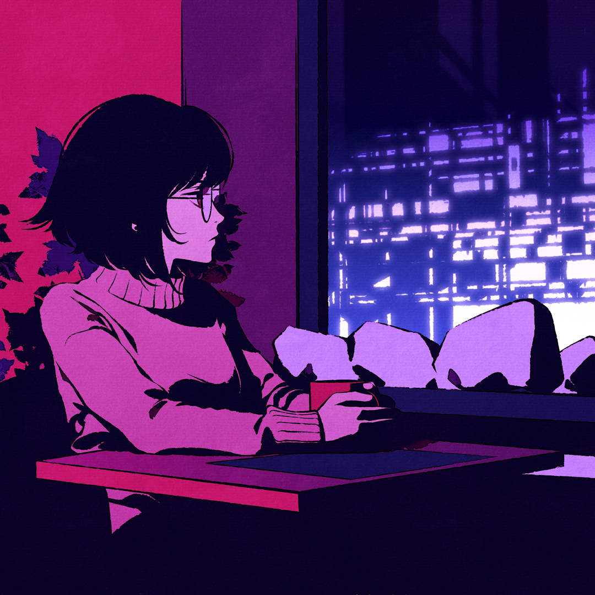

# ASCII Art Tool

#### A Personal Project

## Introduction
**Awareness**  
While I am no artist, I do appreciate the work that goes into making art. 
I've seen lots of ASCII art around the internet, from ASCII [mona lisa](https://pin.it/3yJlvHF "ascii mona lisa pinterest") to [memes](https://imgflip.com/gif/1potkk "ascii doge gif"). It has always been something I was aware of in the back of my mind.  
**The Video**  
After watching a video of making live [ASCII Video](https://youtu.be/55iwMYv8tGI "ASCII Video (Coding Challenge 166) - The Coding Train") I felt I had to start somewhere.

## Aim
The initial aim of this is to automatically make photos into ASCII art.

**My Assets**  
For myself, I wanted to *ASCII-fy* this picture.<br>


Unfortunately, this image is natively 1080x1080 which is a lot of pixels (especially when each pixel is an entire character).  
To solve this my initial solution is to reduce the image size in photo editing software before giving it to the program.


## [Results](./OUTPUT_FILES/ascii_cafe.txt)
```---------------,.........                         
---------------,.........                         
---------------..........                         
---------------..........                         
---------------..........                         
---------------..........                         
---------------..........                        .
--------::----:..........                        .
-------:,     ,..........                         
-------.          .......                      . ,
----:-,            ......              . .. ,  ..:
---.,,             ......          .;-.::-, -...-+
---.                ,....       ..,.;:.:-,-:. ...+
---.                ,....     ..,.,,,,.,,.-:. ..,@
---.               .,....   ....,. .,,,-,,:+....,@
--.            .. .......   ,.     ...@&+:-+  .  ;
:-..          -+,;,......   :, .-..,:--,,.-&&-,-++
.-:.          &H++. .....  .,::H;&:;H@    -@&+:,-@
,-.           +H&@; .....  .-:-;--:-;;,:+;-.@#;--;
.---          :&&&. .....  .-+:-:+#;@@+H&H+H#:+&;@
,---.        ,@@H@  .....  .-:;:-;,,--H;##;$&+$:.H
..:-         .@+&;  .....   :,.,:,,-:,#&@#:#;HH+@&
 ,:. ., ,,.   .    ......   ;-,,,,,-:,:-,;@#$#.@$$
.,-,,:-:+++-,,..   ......   +:,;&-,:+-;-:+H$##+@H#
---.:+;++;;+++;.   ......  ,+::;;-:;;&@;;@;+;+#@:#
-:,,++;:++;::::     .....  ,;:+:,--+++#HHH:+:-####
.  -+++-,;++:,      ....    ;:--+:-:+-$#H&&H@ H$$$
,  ,+;;:,,:+++;-,-- .,..:,  #@;&@;-;&:H&&&&&@ :$$$
.   ;;;++:-:+;++++;  ..+H&&@@-&&&&&;:+&&&&&&+ ,$#&
,   -+++++;:+;;;;;+. , +&&&&&-&&&&&&.@&&&&&H;  &&@
.,  .+;+++;:;;;++;+: +,.H@@&&++H&&&&+&&&&H&&:  +@ 
.   .:+;+;+::++::;+- ,: ,.-&@; -&HH&&+;H@,;#:  :  
     ;:+;;;+--.       :,  ,,-,, ,;;:.;,:   -  .-  
     ::;+;;;- .       ,.,:,:+::                .  
     ,,.;+;+--+;:--,. ,-::,@+;,.                  
      .;--+;;;;;;;+;+-;;::-+@&.                   
      .,. ,+;;;;;;;;;:.::;-:+,                    
           ,;:----:;+:              ....          
     .,-,,,.,....  ..                   ...    -+;
   -::---,,,,,,,,,,.....                     ,:@&&
    ..,,--------,,,,,,,..,..                      
         -, ..,,---:---,,                         
         ,,         ..,--                         
         :;.                                      
         .                                        
                                                  
                                                  
                                                  
                                                  
                                                  
```
#### How do I feel?
It works! No artistic skill required.   
#### Sub-optimal parts   
However, points I will say is that the aspect ratio is not preserved and font of constant width is required to make the image look decent.  

## Closing Remarks and Ways to Improve
Main goal was accomplished and this was a fun thing to do for an afternoon.

**Possible Improvements**
 - Could draw the characters on a screen in the correct postion, rather than print text
 - Work with higher Contrast Photos, or edit photos to be higher contrast
 - Fiddle with the "order of brightness" ASCII characters
 - Reduce scale of image in natively in the program
